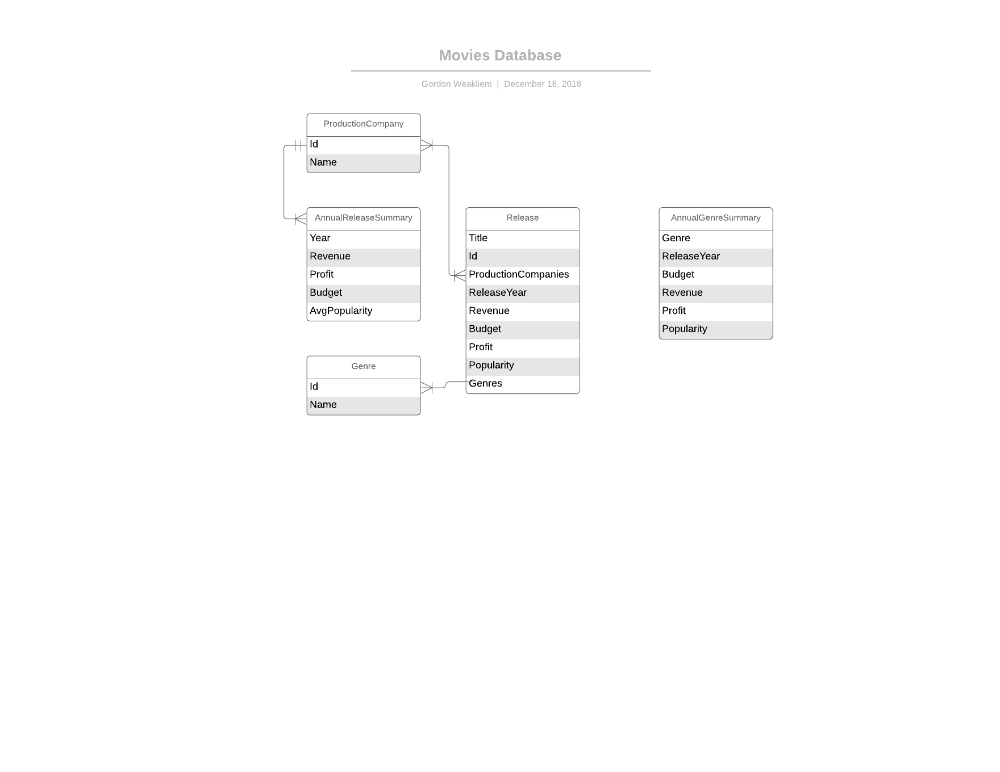

# Data Model

## Production Company Details

### Data Dictionary

* name:  name of production company 
* id: id given in metadata, to key back to original data
* annualBudget: budget per year
* annualRevenue: revenue per year
* annualProfit: profit per year
* releases: releases by genre per year
* avgPopularity: average popularity of produced movies per year

## Entity Relationship Diagram




### Potential Projections

Project into an array of companies containing annualization of the metrics: 

```json
[
    {
        "name": "Pixar",
        "id": "1234",
        "annualRecords": {
            "2018": {
                "budget": 1234,
                "revenue": 43212,
                "profit": 438383,
                "avgPopularity": 21.223,
                "releases": {
                    "comedy": { "title": "Toy Story", "id": "8484" },
                    "action": { "title": "Avengers", "id": "700" }
                }
            },
            "2017": {
                "budget": 1234,
                "revenue": 43212,
                "profit": 438383,
                "avgPopularity": 19.223,
                "releases": {
                    "comedy": { "title": "Stoy Tory", "id": "8434" },
                    "action": { "title": "Vengers", "id": "701" }
                }
            }
        }      
    },
    {
        "name": "Universal": 
        "id": "38383",
        "annualRecords": {
        }
    }
]
```

Project into annualization (partition by year) of companies listing metrics

```json
{
    "annualRecords": {
    "2018": [ {
            "name": "Pixar",
            "id": "1234",
            "budget": 1234,
            "revenue": 43212,
            "profit": 438383,
            "avgPopularity": 21.223,
            "releases": {
                "comedy": { "title": "Toy Story", "id": "8484" },
                "action": { "title": "Avengers", "id": "700" }
            }
        },
        {
            "name": "Fox Searchlight",
            "id": "48484",
            "budget": 1234,
            "revenue": 43212,
            "profit": 438383,
            "avgPopularity": 21.223,
            "releases": {
                "comedy": { "title": "Goodfellas", "id": "884" },
                "horror": { "title": "Halloween 18", "id": "777" }
            }
        }
    ],
    "2017": [ {
            "name": "Universal": 
            "id": "38383",
            "budget": 1234,
            "revenue": 43212,
            "profit": 438383,
            "avgPopularity": 21.223,
            "releases": {
                "comedy": { "title": "Stoy Tory", "id": "8434" },
                "action": { "title": "Vengers", "id": "701" }
            }
        }
    ]
  }
}
```

## Movie Genre Details

* mostPopular: most popular genre by year
* annualBudget: budget by genre by year
* annualRevenue: revenue by genre by year
* annualProfit: profit by genre by year

### Potential projections

Partitioned annually.
```json
{
  "2018": {
    "populararity": { "genre": "action", "id":  "123", "avgPopularity": 79.08},
    "budget": [{ "genre": "comedy", "id":  "456" , "budget": 432234}, { "genre": "action", "id":  "456" , "budget": 84345}],
    "revenue": [{ "genre": "family", "id":  "789", "revenue": 547834}, "genre": "comedy", "id":  "456" , "revenue": 943234],
    "profit": [{ "genre": "action", "id":  "123", "profit": 99443 },{ "genre": "comedy", "id":  "123", "profit": 199443 }]
  },
  "2017": {
    "popularity": { "genre": "action", "id":  "123", "avgPopularity": 81.32 },
    "budget": [{ "genre": "comedy", "id":  "456"}],
    "revenue": [{ "genre": "family", "id":  "789"}],
    "profit": [{ "genre": "action", "id":  "123" }]
  }
}
```

Alternatively, broken out by category

```json
{
     "annualProfit": {
        "2018": [{"genre": "action"
                     "id": 123, "annualProfit": 12345432}],
        "2017": [{}],
        "2016": [{}]
    },
    "annualBudget": {
      "2018": [{ "genre": "comedy", "id": 456, "totalBudget": 5434532 }],
      "2017": [{ "genre": "action", "id": 456, "totalBudget": 453663 }]
    }
}
```

